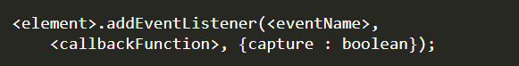
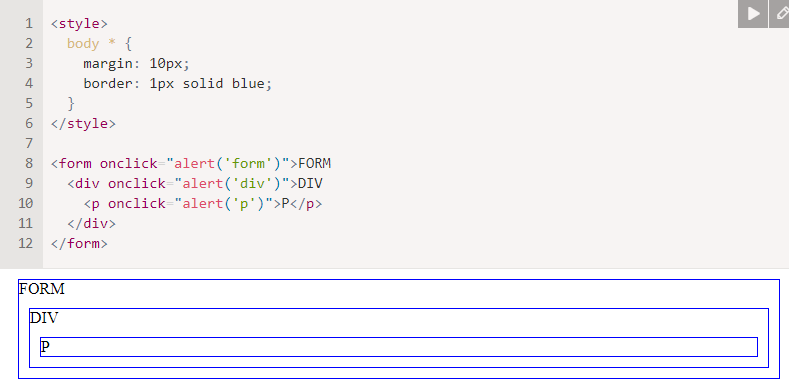
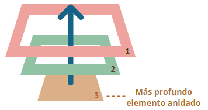
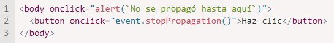
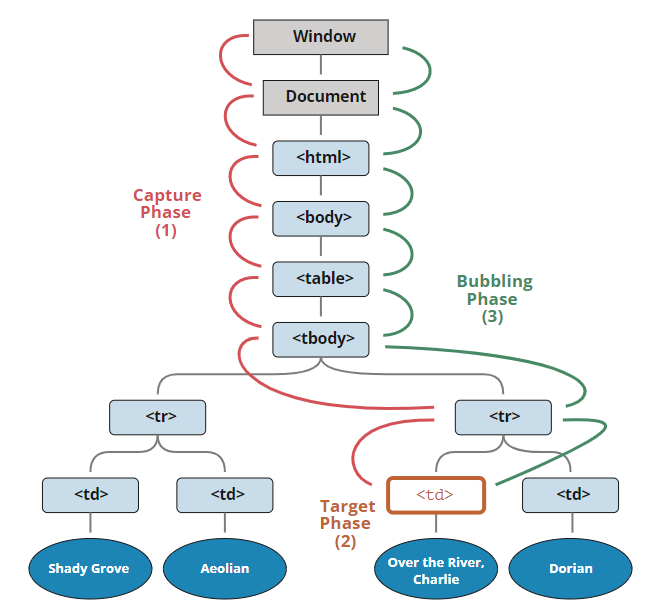

# Captura y propagacion de eventos en Javascript

Luis Francisco Hernandez Yepez 18100191

Un detector de eventos es básicamente una función que espera a que ocurra un evento. Ese evento puede ser cualquier cosa como un evento de clic del mouse, enviar un formulario, presionar teclas de un teclado, etc.

Un detector de eventos contiene tres parámetros y se puede definir utilizando la siguiente sintaxis.

- < elemento> : el elemento al que se adjunta un detector de eventos.

- < eventName>: Pueden ser eventos de 'clic', 'tecla arriba', 'tecla abajo', etc.

- < callbackFunction>: esta función se activa después de que sucedió el evento.

- {capture: boolean}: indica si el evento estará en la fase de captura o en la fase de propagación (opcional)

## El principio de propagación es simple.

Cuando un evento ocurre en un elemento, este primero ejecuta los manejadores que tiene asignados, luego los manejadores de su padre, y así hasta otros ancestros.

Digamos que tenemos 3 elementos anidados FORM > DIV > P con un manejador en cada uno de ellos:

Un clic en el elemento del interior 
 primero ejecuta onclick:

En ese < p>.
Luego en el < div> de arriba.
Luego en el < form> de más arriba.
Y así sucesivamente hasta el objeto document.

Así si hacemos clic en < p>, entonces veremos 3 alertas: p → div → form.

Este proceso se conoce como “propagación” porque los eventos “se propagan” desde el elemento más al interior, a través de los padres, como una burbuja en el agua.

## Detener la propagación

Una propagación de evento empieza desde el elemento objetivo hacia arriba. Normalmente este continúa hasta < html> y luego hacia el objeto document, algunos eventos incluso alcanzan window, llamando a todos los manejadores en el camino.

Pero cualquier manejador podría decidir que el evento se ha procesado por completo y detener su propagación.

El método para esto es event.stopPropagation().

Por ejemplo, aquí body.onclick no funciona si haces clic en < button>:

## Captura

Hay otra fase en el procesamiento de eventos llamada “captura”. Es raro usarla en código real, pero a veces puede ser útil.

El estándar de eventos del DOM describe 3 fases de la propagación de eventos:

- Fase de captura – el evento desciende al elemento.

- Fase de objetivo – el evento alcanza al elemento.

- Fase de propagación – el evento se propaga hacia arriba del elemento.

Aquí está la imagen de un clic en < td> dentro de una tabla, tomada desde la especificación:

Se explica así: por un clic en < td> el evento va primero a través de la cadena de ancestros hacia el elemento (fase de captura), luego alcanza el objetivo y se desencadena ahí (fase de objetivo), y por último va hacia arriba (fase de propagación), ejecutando los manejadores en su camino.