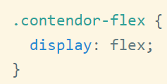
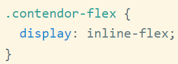
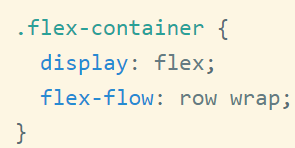
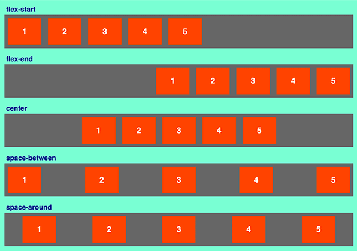
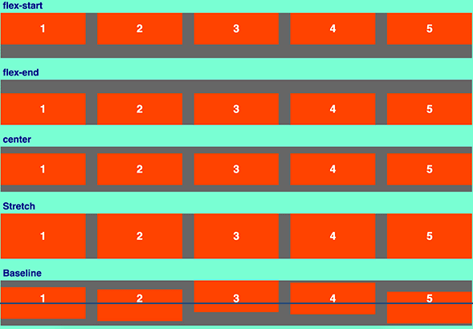
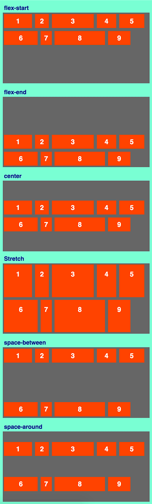

# Instituto Tecnologico de Nuevo Laredo | Ing. Sistemas
## Programacion Web *18100191*

### Propiedades Flexbox:

**DisplayFlex**

Al contenedor principal en un esquema Flexbox es al que le asignamos "display: flex". Esta propiedad hace que cambien las reglas con las cuales sus hijos van a ser representados en la página.

Todos los elementos en la página con la clase "contenedor-flex" se comportarán según las reglas de Flexbox. Ésto implica que sus hijos se van a posicionar de una manera distinta a la habitual. Por lo tanto, debe quedar claro que el propio contenedor no se va a ver afectado, sólo sus hijos.

**Display inline - Flex**

Si conocemos los elementos "inline-block", la diferencia fundamental es la misma que tienen respecto a los elementos "block" normales, que se comportan como un bloque, pero no se exanden para ocupar todo el espacio en la horizontal.

Con inline-flex es como si tuviéramos un elemento inline-block, donde sus hijos se comportan con las reglas de Flexbox.

Una vez el contenedor es "flex" o "inline-flex" puedo aplicarle toda una serie de propiedades adicionales para personalizar todavía más su comportamiento.

**Flex - Direction**

Esta propiedad nos sirve para definir la dirección del flujo de colocación de los elementos. Tiene que ver con los ejes que conocimos en el artículo anterior, pudiendo marcar si los elementos se van a colocar todos en la misma fila, o si se van a colocar en una columna, pero además también permite indicar el orden de los item, normal o reverso.

Permite usar estos valores:

- row (valor predeterminado): Indica que los elementos se colocan en una fila, uno al lado del otro, de izquierda a derecha.

- row-reverse: se colocan en una fila, pero con orden de derecha a izquierda.

- column: se colocan uno debajo del otro, en orden los primeros arriba.

- column-reverse: se colocan en una columna, pero los primeros aparecerán abajo.

**Flex - Wrap**

Sirve para indicar si queremos que haya saltos de línea en los elementos que se colocan en el contenedor, si es que éstos no caben en el espacio disponible.

De manera predeterminada con Flexbox los elementos se colocan en el eje de la horizontal, en una fila. Si los elementos tienen unas dimensiones tales que no quepan en el contenedor, el comportamiento flex hará que se intenten agrupar en la fila de manera que quepan bien sin saltar de línea, pero también podemos configurarlo para hacer que, si no caben, se pasen a la línea siguiente.

- nowrap (predeterminado): hace que nunca se produzcan saltos de línea.

- wrap: hace que si no caben, entonces se coloquen en la siguiente línea.

- wrap: hace que si no caben, entonces se coloquen en la siguiente línea.

**Flex - Flow**

Esta propiedad no aporta nada nuevo, pues simplemente es un atajo para escribir de 1 sola vez flex-direction y flex-wrap. El valor predeterminado es "row nowrap"

**justify-content**

Esta propiedad es muy útil para indicar cómo se van a colocar los justificados y márgenes de los ítems. Puedes indicar que vayan a justificados al inicio del eje o al final del eje o que a la hora de distribuirse se coloque un espacio entre ellos o un espacio entre ellos y los bordes.

Es interesante como para tratarla de manera independiente y así poder ver varios ejemplos de ella. Veamos simplemente sus posibles valores:

- flex-start: Añade los elementos a partir del inicio del eje principal.

- flex-end: Añade los elementos a partir del final del eje principal.

- center: los elementos se centran en el espacio del contenedor, siempre con respecto al eje principal.

- space-between: hace que los elementos se distribuyan con un espacio proporcional entre ellos, siendo que los ítem de los extremos se sitúan en el borde del contenedor.

- space-around: es parecido a space-between en el sentido de dejar un espaciado proporcional, sin embargo, en esta ocasión se deja también espacio entre el borde del contenedor y los ítem de los extremos.

**align-items**

Esta propiedad es muy similar a la propiedad anterior, justify-content, solo que ahora estamos alineando con respecto al eje secundario y no el principal.

En el caso de un contenedor flex cuyo eje principal está en la horizontal, entonces align-items servirá para obtener el alineamiento en el otro eje (vertical, de arriba a abajo). En definitiva, align-items nos ofrece el tan deseado alineamiento vertical que hemos echado en falta en CSS históricamente.

También merece hacer ejemplos específicos para verlo con más detalle, por lo que ahora nos limitaremos a enumerar sus posibles valores con una breve descripción.

- flex-start: indica que se posicionarán al comienzo del eje secundario.

- flex-end: se posicionarán al final del eje secundario.

- center: se posicionarán en el centro del eje secundario.

- stretch: ocuparán el tamaño total del eje secundario (a no ser que hayamos marcado que esos elementos tengan un tamaño diferente).

- baseline: para el posicionamiento de los elementos se tendrá en cuenta el texto que hay escrito dentro.

**align-content**

Esta propiedad sólo aplica cuando dispones de varias líneas de elementos en el contenedor flexbox. El efecto que conseguiremos será una alineación y separación de las filas en el eje secundario.

El efecto que conseguimos con align-content es parecido al que conseguimos con align-items, en el sentido que aplicará al eje secundario su efecto de distribución, solo que aquí no estamos indicando la colocación de una única fila, sino de todas las filas. Además se parece también a justify-content en el sentido que estamos definiendo la separación entre ítems, pero afectando a filas de ítems en vez de ítems sueltos.

- flex-start: indica que las filas se colocarán todas pegadas entre sí (obviamente no aparecerán exactamente pegadas si le hemos colocado un margin), desde el inicio del eje secundario.

- flex-end: las filas se colocarán pegadas entre sí, pero esta vez pegadas al final del eje secundario.

- center: se posicionarán en el centro del eje secundario, pegadas entre sí.

- stretch: Sus dimensiones crecerán para ocupar todo el espacio disponible (a no ser que se haya colocado una dimensión diferente en los elementos).

- space-between: indica que las filas se separarán entre sí, dejando un espacio proporcional entre ellas.

- space-around: indica que las filas se separarán, dejando un espacio entre ellas proporcional, también con el borde.

