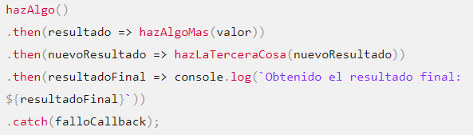

# Promesas 

## TECNM | Luis Francisco Hernandez Yepez 18100191

Una Promise (promesa en español) es un objeto que representa la terminación o el fracaso de una operación asíncrona. Dado que la mayoría de las personas consumen promises ya creadas, esta guía explicará primero cómo consumirlas, y luego cómo crearlas.

Esencialmente, una promesa es un objeto devuelto al cuál se adjuntan funciones callback, en lugar de pasar callbacks a una función.

Considera la función crearArchivoAudioAsync(), el cuál genera de manera asíncrona un archivo de sonido de acuerdo a un archivo de configuración, y dos funciones callback, una que es llamada si el archivo de audio es creado satisfactoriamente, y la otra que es llamada si ocurre un error. El código podría verse de la siguiente forma:

las funciones modernas devuelven un objeto promise al que puedes adjuntar funciones de retorno (callbacks). Si crearArchivoAudioAsync fuera escrita de manera tal que devuelva un objeto promise, usarla sería tan simple como esto:

## Garantías

A diferencia de las funciones callback pasadas al "viejo estilo", una promesa viene con algunas garantías:

- Las funciones callback nunca serán llamadas antes de la terminación de la ejecución actual del bucle de eventos de JavaScript.

- Las funciones callback añadidas con then() incluso después del éxito o fracaso de la operación asíncrona serán llamadas como se mostró anteriormente.

- Múltiples funciones callback pueden ser añadidas llamando a then() varias veces. Cada una de ellas es ejecutada una seguida de la otra, en el orden en el que fueron insertadas.

## Encadenamiento

Una necesidad común es el ejecutar dos o más operaciones asíncronas seguidas, donde cada operación posterior se inicia cuando la operación previa tiene éxito, con el resultado del paso previo. Logramos esto creando una cadena de objetos promises.

Aquí está la magia: la función then() devuelve una promesa nueva, diferente de la original:

## Encadenar despues de una captura

Es posible encadenar después de un fallo - por ejemplo: un catch- lo que es útil para lograr nuevas acciones incluso después de una acción fallida en la cadena. Lea el siguiente ejemplo:

## Propagación de errores

Tal vez recuerdes haber visto falloCallback tres veces en la pirámide en un ejemplo anterior, en comparación con sólo una vez al final de la cadena de promesas:

Básicamente, una cadena de promesas se detiene si hay una excepción, y recorre la cadena buscando manejadores de captura. Lo siguiente está mucho más adaptado a la forma de trabajo del código síncrono:

### Estas son solo algunas de las ventajas que tenemos al usar Promesas. Dentro del curso de Programacion web seguiremos explorando mas de ellas junto con el maestro Gerardo Pineda.

